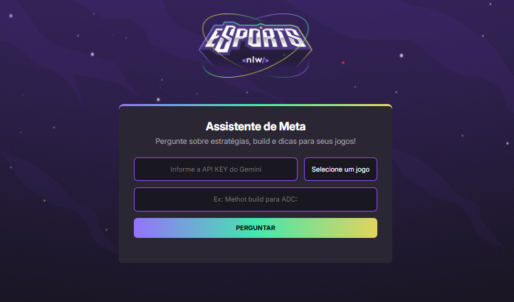

# 🎮 Assistente de Meta



**Assistente de Meta** é uma aplicação web que utiliza inteligência artificial para responder perguntas estratégicas sobre os jogos **Valorant**, **League of Legends (LoL)** e **CS:GO**.  
Com base na API Gemini, você pode obter dicas, builds, estratégias e muito mais!

---

## ⚠️ AVISO IMPORTANTE

> **NUNCA compartilhe sua chave de API (API KEY) com terceiros.**
>
> Ela é **pessoal, intransferível** e pode gerar **custos em sua conta** ou permitir **acesso indevido**.  
> Sempre mantenha sua chave segura e evite inseri-la em locais públicos ou repositórios versionados.

---

## 📷 Imagem do Projeto


---

## 🧠 Funcionalidades

- Autenticação com API Gemini
- Interface intuitiva com design gamer
- Seleção entre três jogos populares
- Envio de perguntas personalizadas sobre estratégias, builds e meta
- Resposta automatizada utilizando IA (via Gemini API)
- Design com gradiente moderno e responsivo

---

## 📂 Estrutura de Arquivos

```
assistente-de-meta/
│
├── index.html             # Página principal
├── style.css              # Estilo do projeto
├── script.js              # Lógica de conexão com API e interface
├── /assets
│   ├── logo.png           # Logotipo do projeto
│   └── bd6e995d...png     # Imagem de preview do projeto
└── README.md              # Este arquivo
```

---

## 🚀 Como Usar

### 1. Obtenha sua API Key

Crie uma conta no Google AI Studio e gere sua chave:  
👉 https://aistudio.google.com/app/apikey

> **Importante:** Nunca compartilhe sua chave com ninguém!

---

### 2. Clone este repositório

```bash
git clone https://github.com/seu-usuario/assistente-de-meta.git
cd assistente-de-meta
```

---

### 3. Execute localmente

Abra o arquivo `index.html` no navegador.  
Nenhuma instalação extra é necessária, tudo roda no front-end.

---

### 4. Use o Assistente

- Insira sua API KEY Gemini
- Selecione um dos jogos: Valorant, League of Legends ou CS:GO
- Faça sua pergunta (ex: "Qual a melhor composição para ranqueada?")
- Clique em **PERGUNTAR**

A IA irá responder com base no meta atual do jogo selecionado.

---

## 📌 Exemplos de Perguntas

- *Valorant:* "Qual agente é melhor para o mapa Ascent?"
- *LoL:* "Qual build para ADC no patch atual?"
- *CS:GO:* "Como posicionar melhor CT na Dust2?"

---

## 🧱 Tecnologias Utilizadas

- **HTML5** e **CSS3**
- **JavaScript** puro
- **Showdown.js** (conversão Markdown → HTML)
- **Google Fonts - Inter**
- **Gemini API** do Google AI

---

## 🛡️ Segurança

- Nenhuma informação pessoal ou da API é armazenada no projeto.
- Toda comunicação com a Gemini API acontece diretamente no navegador do usuário.
- O projeto **não salva, envia ou compartilha sua API KEY**.

---

## 📄 Licença

Este projeto é open-source e pode ser usado livremente para fins **pessoais e educacionais**.  
Para uso comercial, entre em contato com o autor.

---

## 🤝 Contribuição

Contribuições são bem-vindas!  
Você pode abrir issues, enviar sugestões ou criar pull requests com melhorias.

---

## ✨ Autor

Desenvolvido por Anderson Gonçalves  
Portfólio: https://github.com/AndersonJunior95